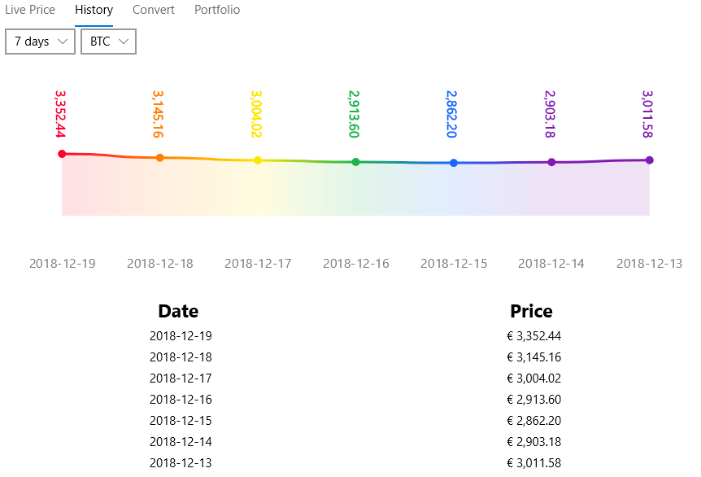

# CryptoPrice

CryptoPrice is a cryptocurrency price ticker & converter app for Android and Universal Windows Playform. It allows you to view the real-time and Historical prices of various cryptocurrencies, such as Bitcoin, Litecoin and Ethereum.

# Live Price screen

The live price screen displays the current price of the cryptocurrency. The cryptocurrency can be changed using the drop down Additionally it displays the value of the users portfolio, if one has been configured. Clicking on the price causes it to refresh and show the latest price.

# History screen

The history screen displays a graph of the price of a cryptocurrency over the last 7 days, as well as a table showing the average price for each day.

# Converter screen

The converter screen allows you to convert from Bitcoin, Litecoin and Ethereum to Euro and USD.

# Portfolio screen

The portfolio screen allows you to enter the amount of each cryptocurrency you own. It will the calculate the total and display it on the home screen (when it isn't bugged :( ).

# API

This project uses the BitcoinAverage.com API. This means the app will not work without internet as it cannot fetch pricing data. Additionally there is a limit of 700 API calls per IP per 24 hours.
